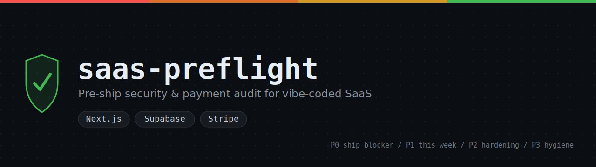
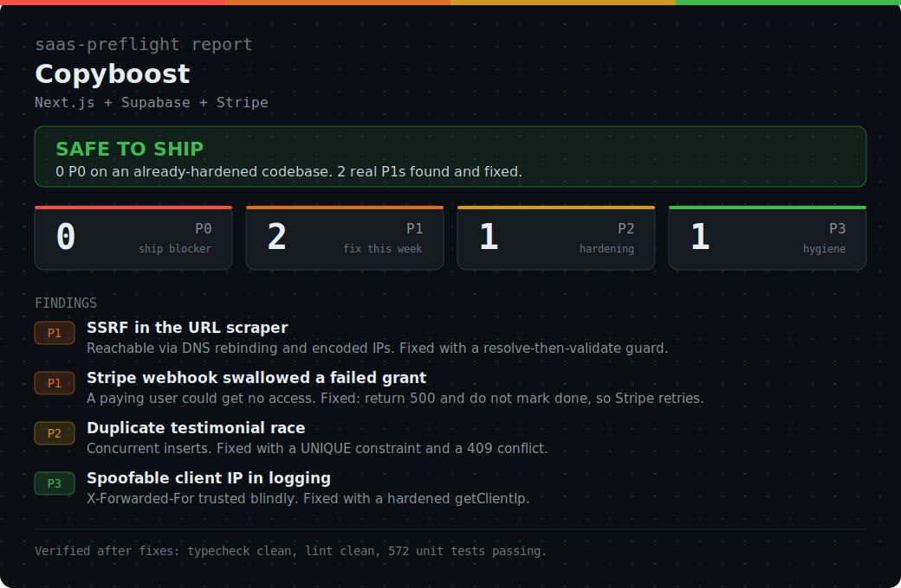

<p align="center">
  
</p>

<p align="center">
  
  
  
  
</p>

<p align="center"><b>The pre-ship audit for SaaS that takes money.</b><br>
It finds the billing and data-isolation holes the generic scanners miss, on the Next.js + Supabase + Stripe stack.</p>

---

You vibe-coded a SaaS. It charges with Stripe and stores user data in Supabase.
Two questions you cannot answer right now:

1. Can a stranger read another user's data?
2. Can a stranger get your paid plan for free?

There are already good general security scanners for AI-built apps. They catch
hardcoded secrets, XSS, CORS, SQL injection. Use them, they are worth it. But
they barely touch the layer that actually loses you money and trust: the billing
logic and the data-isolation logic of a real SaaS. A forgeable Stripe webhook. A
paid plan unlocked from the success redirect URL. A guest-checkout race. A quota
two requests slip past at once. A cancellation your code never handles, so the
user keeps Pro for free forever.

`saas-preflight` is built for exactly that layer, by someone who shipped those
bugs and fixed them the hard way.

It is **defensive only.** It finds weaknesses in your own code so you can close
them. It writes no exploits and touches nothing you do not own.

## See it in action

<p align="center">
  
</p>

## What it checks

Seven lenses, run in order, plus a conditional eighth that runs only for
multi-tenant apps. The ones in bold are where the generic scanners go quiet and
this one goes deep.

1. **Auth / authz**: can a logged-in user reach data that is not theirs (IDOR,
   missing server-side checks, middleware that fails open, Supabase RLS off)?
2. **Atomicity**: can an operation leave money charged but access not granted?
3. **Idempotency**: does a Stripe webhook delivered twice grant or charge twice?
4. Degraded mode: when Stripe or Supabase hiccups, does it fail safe or open?
5. Input validation: is untrusted input bounded before the DB, disk, an
   outbound fetch (SSRF), or the DOM?
6. Config drift: secrets shipped to the browser, test vs live key mismatches,
   broken redirect URLs.
7. **Abuse / cost**: can an anonymous user drain your LLM or email bill, or
   slip past a freemium quota through a race?
8. **Tenant isolation (multi-tenant only)**: in a multi-tenant or white-label
   app, can one tenant reach another tenant's data or session (a session cookie
   shared across subdomains, a forged tenant header, a custom domain still
   serving after a downgrade)? Runs only when the scanner detects multi-tenant
   signals, and is skipped for single-tenant apps.

Also flagged: mass-assignment writes (`role`/`is_pro`/`plan` set straight from
the request body), CSRF on cookie-session route handlers, public Supabase
Storage buckets, and open redirects after auth.

Every finding comes back as P0 (ship blocker), P1 (fix this week), P2
(hardening), or P3 (hygiene), with a file, a line, and a concrete fix.

## How it works

A fast grep scanner surfaces candidates in seconds. Then the agent verifies each
one by reading the actual code, because grep cannot prove a vulnerability. You
get leads turned into confirmed findings, not a wall of false positives.

On a machine without bash (plain Windows, no Git Bash or WSL), the scanner step
is skipped and the agent does the triage by reading the code itself. The audit
is never blocked.

## Install

Claude Code:

```bash
git clone https://github.com/Comoco235/saas-preflight ~/.claude/skills/saas-preflight
```

Then tell Claude: *"audit my SaaS before I ship"* and point it at your repo. The
skill triggers on its own when you talk about shipping, going to production, or
whether your app is secure.

It uses the open `SKILL.md` standard, so it also works in Cursor, Codex CLI, and
other agents that adopted it. Drop the folder into their skills directory.

## Run the scanner directly

For a quick first look, without an agent:

```bash
bash scripts/scan.sh /path/to/your/repo
```

Or, native on Windows (no bash needed):

```powershell
powershell -File scripts/scan.ps1 C:/path/to/your/repo
```

Read-only. It changes nothing and makes no network calls.

## Why I built this

I ship SaaS solo, fast, with AI. I have personally hit every one of these seven
failure modes in my own products and fixed them the hard way: a Stripe webhook
that failed silently so nobody's subscription activated, a middleware that
failed open under load, a guest-checkout race, quota counters two requests
slipped past at once. This skill is that scar tissue, written down, so you do
not have to learn it the way I did.

Built by [sl2s](https://www.builtwithbugs.com). If it caught something real in
your code, that is the whole point. Tell me what it found.

## License

MIT. Use it, fork it, improve it.